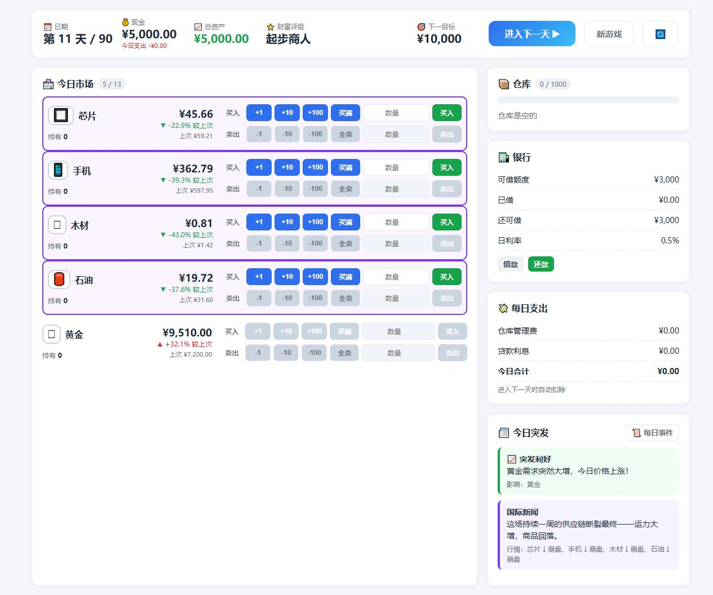

# 倒卖大亨

一款以 90 天为周期的纯前端经营交易游戏。玩家从 5,000 元启动资金开始，在随机行情、突发新闻和持续性国际事件中低买高卖，尽可能提高最终资产。

- **在线体验：** [https://greatlai.github.io/trader-tycoon/](https://greatlai.github.io/trader-tycoon/)
- **当前版本：** v1.17.1
- **维护状态：** 由仓库所有者持续维护



## 核心玩法

- 90 个交易日，开局首日必有一条上涨与一条下跌的普通突发新闻；常规行情随机上架 6 种商品，生态行情从新闻发布当天起扩展到 7 种。
- 20 种商品分为低价、中价、高价和超高价值档位，并以模糊标签公开长期行情性格。
- 每种商品拥有独立的波动、均值回归、趋势惯性、事件敏感度和上架权重。
- 10 组国际生态事件采用 A/B/C 分支，在 4 天内持续影响 4 种商品。
- 突发新闻使用统一的双基准方向规则：利好必须高于昨日实际价和当日无事件行情，利空必须低于两者，避免新闻方向与实际价格价值脱节。
- 经营费分六个 15 天账期固定收取，90 天合计 247.59 万元；仓储费按库存收取，开市弹窗会列明费用、清算与资产变化。
- 现金不足时优先按当日市价清算已上架库存；仍不足时，未上架库存按实际购入均价的 20% 处理，禁售状态不可绕过。
- 财富评级提升后自动扩大仓库；历史最高资产达到千万后永久解锁高价值商品。
- 五个职业默认开放：“生意人”遵循标准规则；“牙行商”以低价行情和风险抬价寻找利润；“行脚商”通过熟路与赶集重获出货窗口；“投机客”追逐自然突发事件；“盐铁商”只能经营四种指定商品，将全部行情偏离放大 3 倍，并以风向标召来相关生态事件。
- 每个职业每局均有 3 枚“通商令”，可让一件持有但未上架的商品重新报价并临时加入当日市场；报价方向不可控制，并有 15% 概率触发普通突发事件。
- 市场快捷交易可在数量与比例模式间切换：数量模式保留 `+1`、`+10`、`+100`、买满和全卖，比例模式按当前最大可买数量或持仓的 `25%`、`50%`、`75%`、`100%` 成交。
- 自定义数量输入、按钮成交和回车成交始终保留；快捷交易模式会随存档保存。
- 盈利卖出会即时显示单笔利润与收益率；关键交易、解套、危机抄底和职业操作会触发每局一次的成就播报。
- 游戏状态自动保存在浏览器 `localStorage` 中；加载旧存档时会补齐职业与禁售状态字段。

## 技术特点

- 原生 HTML、CSS 和 JavaScript，不依赖前端框架。
- 无构建步骤、无运行时依赖，可以直接部署到静态托管服务。
- 游戏状态、交易、事件、结算、存档和界面渲染按模块拆分。
- 使用经典 `<script>` 加载，支持直接打开 `index.html`。
- Node.js 内置测试运行器负责规则回归测试，不引入第三方测试框架。

## 本地运行

最简单的方式是直接用浏览器打开 `index.html`。

如需测试版本检查等网络请求，建议在项目目录启动本地静态服务器：

```powershell
python -m http.server 4173
```

然后访问 `http://127.0.0.1:4173/`。

## 自动测试

需要 Node.js 20 或更高版本：

```powershell
npm test
```

当前回归测试覆盖：

- 商品解锁与初始市场规则
- 强制平仓、禁售与行脚商路费结算
- 90 天结束边界
- 历史存档与职业运行状态迁移
- 生态事件数据完整性
- 页面关键结构和版本一致性
- 行内交易控件与桌面、手机端稳定布局
- 百分比交易计算、模式切换和旧存档默认值
- 确定性完整游戏模拟

## 项目结构

```text
trader-tycoon/
├── .github/             # GitHub Issue 模板
├── css/                 # 页面样式
├── docs/                # 截图、维护记录与历史资料
├── js/                  # 游戏配置、规则和界面逻辑
├── scripts/             # 仓库维护脚本
├── tests/               # Node.js 回归测试
├── index.html           # 游戏入口
├── CHANGELOG.md         # 版本记录
├── package.json         # 测试命令
└── version.json         # 线上版本检查
```

核心脚本按以下顺序加载：

```text
config -> utils -> eco -> professions -> rules -> profile -> state -> market_actions
       -> events -> trading -> game -> save -> ui -> main
```

职业扩展采用独立规则上下文：单局保存职业 ID、技能冷却和职业运行数据，各职业成绩保存在独立生涯档案中。“生意人”保持标准市场规则；“牙行商”改变普通价格区间并承担抬价失败风险；“行脚商”以赶集路费换取库存重新报价；“投机客”放大自然事件，并可安排次日方向不确定的后续报道；“盐铁商”通过逐商品规则限制交易范围、放大普通与事件行情，并从现有生态事件池召唤相关事件。通商令作为独立的通用行动计数，不占用职业技能冷却。

更多资料见 [docs/README.md](docs/README.md)。

## 部署

项目通过 GitHub Pages 从 `main` 分支发布。推送到主分支后，Pages 会自动更新线上版本。

发布新版本时需要同步修改：

1. `js/config.js` 中的 `APP_VERSION`
2. `version.json`
3. `index.html` 中静态资源的版本查询参数
4. `CHANGELOG.md` 和 GitHub Release

## 权利说明

本仓库目前未提供开源许可证。除 GitHub 平台正常浏览和在线体验外，未经仓库所有者明确许可，不授予复制、修改、再发布或商业使用代码的权利。
